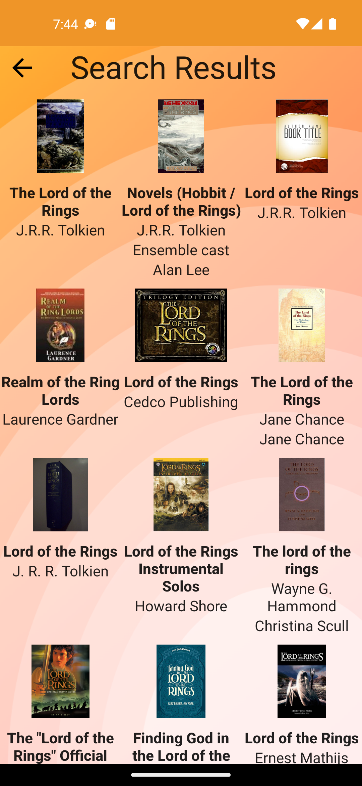

 

## Open Library book search in Kotlin with Clean Architecture/MVVM and Jetpack Compose

> An Android application which allows a user to search for a book with Open Library.

Screens

1) Books Search

This screen contains a single text field for inputting a book title for search.
The screen has a single button labelled "Search" which searches for books on Open Library.
If no books are found, an error dialog appears.
If books are found, then the user is taken to a books list screen showing the book cover and title, author for each book result.
The "Search" button is disabled when the input text field is empty.

2) Books List

The screen has a "Back" button at the top left that will return the user to the "Books Search" screen.
The books are displayed in a grid layout.
Clicking a book card takes the user to a book details screen.

3) Book Details

The screen has a "Back" button at the top left that will return the user to the "Books List" screen.
The title of the selected book appears at the top of the screen above the book cover and list of authors.

In this repo you'll find: 
* A single activity architecture using **[Jetpack Compose](https://developer.android.com/jetpack/compose)**. 
  The UI state is represented as plain classes that hold the UI state as per **[this](https://developer.android.com/topic/architecture/ui-layer/events#compose_2)** guidance from Google. 
  UI state is handled using **[StateFlow](https://developer.android.com/kotlin/flow/stateflow-and-sharedflow)** for remote data in order to take advantage of **[SavedStateHandle](https://developer.android.com/topic/libraries/architecture/viewmodel/viewmodel-savedstate)**  
* User Interface built with a **[ViewModel](https://developer.android.com/topic/libraries/architecture/viewmodel)** for each screen that displays state. 
* Use cases are implemented to separate business logic from the view models. 
* The user interface is built using **[Jetpack Compose Navigation](https://developer.android.com/jetpack/compose/navigation)**. 
* Dependency injection using **[Hilt](https://developer.android.com/jetpack/androidx/releases/hilt)** . 
* Unit and UI tests using Jacoco for determining code coverage. 
* Square's LeakCanary is implemented to detect memory leaks. 
* Internationalized string resources for English and French. 
* KTLint is included in the build path to enforce formatting standards. 

## Running tests

Type this command at the command line to run the unit tests suite.

./gradlew createDebugCoverageReport

Find the test results here: app/build/reports/androidTests/connected/index.html
Find the coverage report here: app/build/reports/coverage/androidTest/debug/index.html

or 

./gradlew createDebugUnitTestCoverageReport

Find the test results here: app/build/reports/tests/testDebugUnitTest/index.html
Find the coverage report here: app/build/reports/coverage/test/debug/index.html

## Screen Shots

<table>
<tr>

<td>

</td>

<td>

</td>

<td>

</td>

</tr>
</table>

TODO
Improve UI design
Add search results sub title
Add screen transition animations
Center book title on book details screen
Set proper image sizes
Maybe add sorting or filtering?
Flex all error states
Make sure null values don't get passed as parameters
Move everything to resource folders
Improve image URl formatting
Take screen shots of the finalized design for this readme